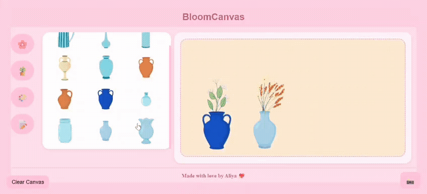
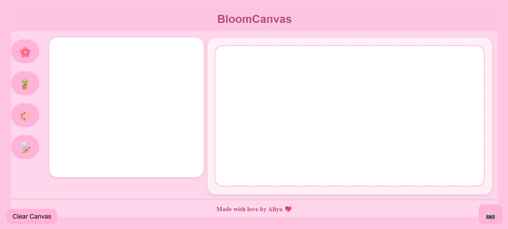
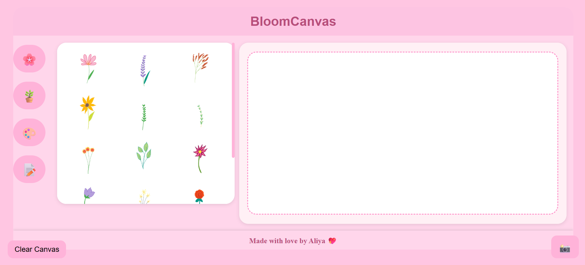
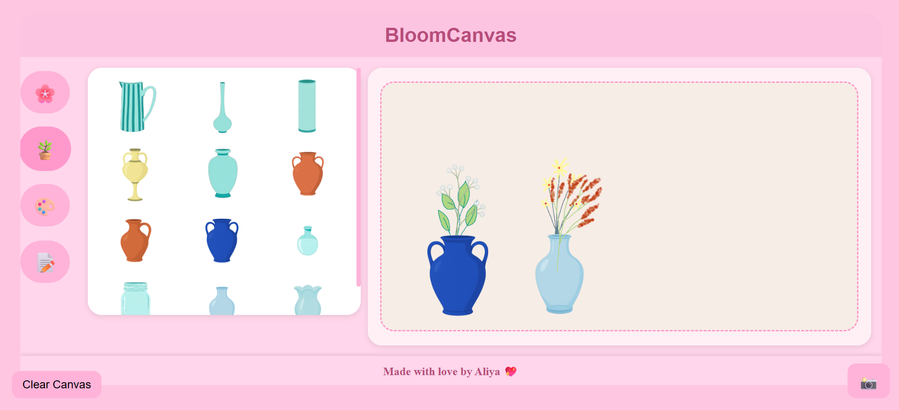
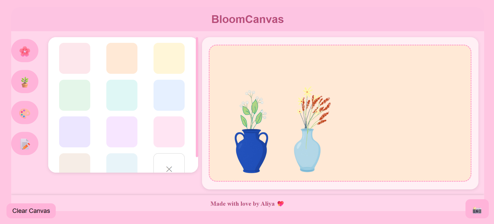
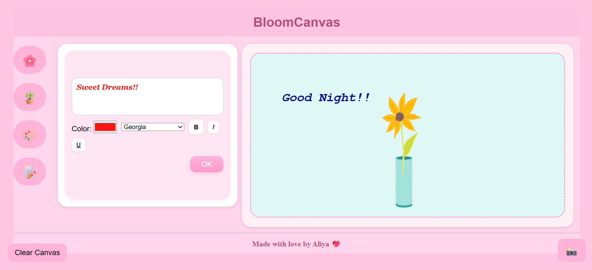
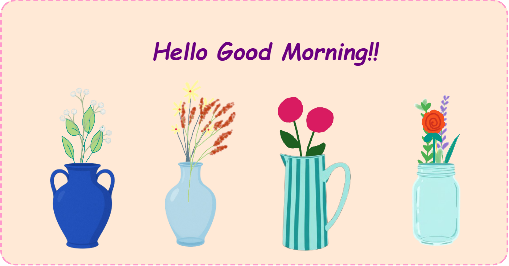

# 🌸 BloomCanvas

✨ A Canva-inspired web application that allows users to create aesthetic designs using drag-and-drop elements, styled text, and customizable backgrounds.

---

## 🚀 Live Demo
👉 https://aliya26205.github.io/bloomcanvas/

---

## 🎥 Demo

  

---

## 📸 Preview

### 🏠 Main Interface

### 🌸 Flower Selection Panel

### 🪴 Pots Collection

### 🎨 Background Options

### 📝 Text Customization

### 📸 Final Design Output

---

## ✨ Features

- 🎨 Drag & drop decorative elements (flowers, pots, etc.)
- 📝 Add and customize text (font, color, bold, italic, underline)
- 🖌️ Change canvas background colors
- 🔄 Resize and rotate elements
- 📸 Download final design as an image
- 🧹 Clear canvas instantly
- 📱 Fully responsive (mobile + desktop)

---

## 🎨 Unique Highlight

> 🌟 All flower and decorative elements used in this project are **digitally hand-drawn by me**, making BloomCanvas not just a development project but also a creative design showcase.

---

## 🛠️ Tech Stack

- HTML5  
- CSS3  
- JavaScript (Vanilla JS)  
- html2canvas  

---

## ⚙️ How It Works

### 1️⃣ Select Elements
Use the sidebar to choose:
- Flowers 🌸  
- Pots 🪴  
- Background 🎨  
- Text 📝  

---

### 2️⃣ Add to Canvas
Click on any element → it appears on the canvas.

---

### 3️⃣ Customize Elements
- Drag → Move elements  
- Resize → Adjust size  
- Rotate → Rotate elements  

---

### 4️⃣ Add Text
- Enter text  
- Customize:
  - Color  
  - Font  
  - Style (bold, italic, underline)  

---

### 5️⃣ Change Background
Select a background color → canvas updates instantly.

---

### 6️⃣ Export Design
Click 📸 → your design is downloaded as an image using html2canvas.

---

## 📂 Project Structure
bloomcanvas/
│── index.html
│── style.css
│── script.js
│── assets/

---

## 🧠 What I Learned

- DOM manipulation  
- Event handling (click & touch events)  
- Drag-and-drop implementation  
- Responsive design  
- Debugging real-world issues (mobile compatibility & caching)

---

## 🚧 Future Improvements

- Undo / Redo functionality  
- Layer management (bring forward / send backward)  
- Save & load designs  
- More elements and templates  

---

## 👩‍💻 Author

**Aliya Banu**

---

## 💖 Inspiration

Inspired by Canva to simplify creative design experiences.
